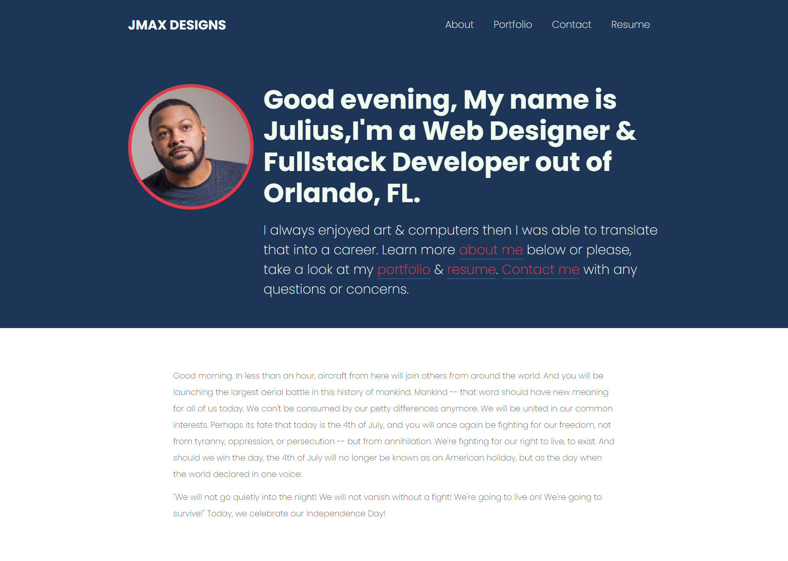

# jmaxdesigns2.0

# Description
Jmax designs is a Professional Portfolio, single page application(SPA) built using react.  [here](https://jmax407.github.io/jmaxdesigns2.0/).

# Table of Contents
- [Installation](#installation)
- [Usage](#usage)
- [License](#license)
- [Contributing](#contributing)
- [Tests](#tests)
- [Questions](#questions)

# Installation
`npx install create-react-app`
After cloning the code run `npm install` in the root of the project in the command line. After running `npm install` run `npm start` to start the server.

# Usage
The live application can be found [here](https://jmax407.github.io/jmaxdesigns2.0/).

# License
This project is covered by the [MIT](https://spdx.org/licenses/MIT.html) license.

# Contributing
Julius Maxwell

# Tests
Currently there are no tests for this application.

# Questions
Contact me with any questions at my email or GitHub. [Email](mailto:jmax407@gmail.com), [GitHub](https://github.com/jmax407)